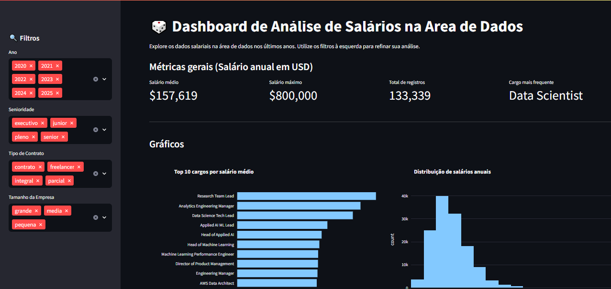

# Dashboard de Análise de Dados

Este dashboard permite analisar salários na área de dados, considerando fatores como senioridade, tipo de contrato, localização e trabalho remoto.

## Tecnologias utilizadas
- Python
- Streamlit
- Pandas
- Plotly

## Preview do Dashboard


## Estrutura do projeto
- `app.py` → aplicação principal do dashboard
- `requirements.txt` → bibliotecas necessárias
- `README.md` → documentação do projeto

## Funcionalidades
- Visualização de dados em gráficos interativos
- Análise de salários
- Filtros dinâmicos para exploração dos dados

## Dataset

Os dados utilizados neste projeto estão disponíveis no arquivo `dados-imersao.csv`.

## Como executar o projeto

```bash
pip install -r requirements.txt
streamlit run app.py
```
